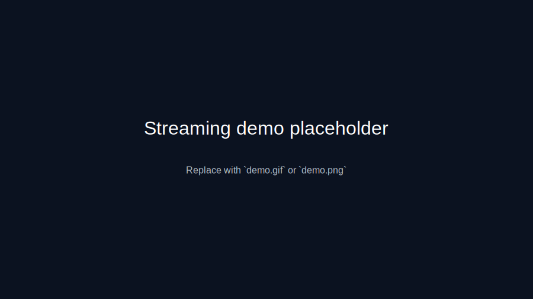

# Transmission Routes - Live Route Streaming

<div align="center">

[](https://flutter.dev)
[](LICENSE)
[](https://flutter.dev)
[](CONTRIBUTING.md)
[](CHANGELOG.md)
[](screenshots/demo.svg)

**Flutter app to stream live video and GPS while driving, optimized for 4G/5G networks.**

[Features](#-key-features) • [Installation](#️-quick-installation) • [Usage](#-usage) • [Architecture](#️-getx-mvc-architecture) • [Contributing](CONTRIBUTING.md)

---


</div>

## 📖 Table of Contents

- [Key Features](#-key-features)
- [Demo](#-demo)
- [Requirements](#-requirements)
- [Quick Installation](#️-quick-installation)
- [Usage](#-usage)
- [Architecture](#️-getx-mvc-architecture)
- [Data Usage](#-data-usage)
- [Troubleshooting](#-troubleshooting)
- [Security](#-security)
- [Production Build](#-production-build)
- [Server Setup](#-server-setup)
- [Roadmap](#-roadmap)
- [Contributing](#-contributing)
- [License](#-license)
- [Acknowledgments](#-acknowledgments)

## 🔑 Key Features

- **WebRTC Streaming**: Video 640x480@30fps or 426x240@15fps (power-saving mode)
- **Real-time GPS**: Tracking every 1–3 seconds with statistics calculation
- **Power Saving Mode**: Automatic reduction of bitrate/FPS/GPS based on network
- **Automatic Reconnection**: 30s grace period to recover connection
- **Network Monitoring**: Latency and quality monitoring with dynamic adjustments
- **Route History**: Export GPX/KML/JSON with anonymization
- **JWT Authentication**: Secure login with 7-day tokens
- **GetX MVC**: Reactive state management

## 🎬 Demo

[](screenshots/demo.svg)

Click the image to view the demo. Replace with an animated `demo.gif` for a live preview (keep GIFs small: ≤ 3–5 MB).

See the [`screenshots/`](screenshots/) directory for more images and guidelines.

### Key Screens

- **Login**: Secure JWT authentication
- **Home**: Network status, battery level, and quick start controls
- **Streaming**: Live video feed with real-time GPS, speed, and viewer count
- **Route History**: Browse and export past routes with map visualization

## 📋 Requirements

- Flutter >= 3.10.1
- Android >= 6.0 (API 23) or iOS >= 12.0
- `get_transmission` server running
- Permissions: camera, location

## ⚙️ Quick Installation

```bash
cd transmission_routes
flutter pub get
```

Set your server IP in `lib/config/api_config.dart`:

```dart
static const String baseUrl = 'http://YOUR_IP:3000/api';
static const String wsUrl = 'http://YOUR_IP:3000';
```

**Important**: Android emulator = `10.0.2.2`, physical device = local IP

## ▶️ Run

```bash
flutter run
```

**Demo login**: User `demo`, Password `demo123`

## 📱 Usage

1. Login → Home → Check network/battery/permissions
2. START → Stream live video + GPS
3. View viewers, speed, network, battery in real time
4. Enable power saving if network is poor
5. STOP → Route is saved automatically
6. History → Export routes with optional anonymization

## 🏗️ GetX MVC Architecture

```
lib/
├── main.dart
├── config/api_config.dart
├── models/ (User, Route, RoutePoint)
├── services/ (Auth, Settings, WebRTC, Signaling, Location, Metadata, Network)
├── controllers/ (Streaming, RoutesHistory)
├── views/ (Login, Home, Streaming, Settings*, History*)
├── routes/ (AppRoutes, AppPages)
├── bindings/ (Initial, Streaming)
└── utils/ (DataUsageEstimator)
```

*Full implementation pending

## 📊 Data Usage

| Mode | Data/hour | Battery/hour | Resolution | FPS |
|------|-----------|--------------|------------|-----|
| Normal | 675 MB | 25% | 640x480 | 30 |
| Power-saving | 180 MB | 15% | 426x240 | 15 |

## �️ Server Setup

This app requires the **get_transmission** server to be running. 

📦 **Server Repository**: [kevindels/get_transmission](https://github.com/kevindels/get_transmission)

### Quick Server Setup

```bash
# Clone the server repository
git clone https://github.com/kevindels/get_transmission.git
cd get_transmission

# Install dependencies
npm install

# Start the server
npm start
```

The server will run on `http://localhost:3000` by default. Make sure to update the IP address in `lib/config/api_config.dart` to match your server's address.

## 🐞 Troubleshooting

**Doesn't connect**: Check the IP in `api_config.dart`, ensure the server is running, check firewall

**No video**: Check camera permissions, run `flutter logs`

**No GPS**: Enable location and permissions

**High battery usage**: Use power saving mode, reduce maximum duration

**Stream limit**: Maximum 10 viewers, wait for availability

## 🔒 Security

- JWT stored in SharedPreferences
- Use HTTPS in production
- GPS anonymization 0–1000m
- Video only, no audio

For security vulnerabilities, please see our [Security Policy](SECURITY.md).

## 🗺️ Roadmap

- [ ] Complete Settings view implementation
- [ ] Complete History view with map visualization
- [ ] Add support for multiple cameras
- [ ] Implement audio streaming (optional)
- [ ] Add picture-in-picture mode
- [ ] Cloud storage integration for route history
- [ ] Multi-language support (Spanish, English)
- [ ] Dark mode theme
- [ ] Widget for quick stream start
- [ ] Apple Watch / Wear OS companion app

See the [open issues](https://github.com/kevindels/transmission_routes/issues) for a full list of proposed features and known issues.

## 🤝 Contributing

Contributions are what make the open source community such an amazing place to learn, inspire, and create. Any contributions you make are **greatly appreciated**.

1. Fork the Project
2. Create your Feature Branch (`git checkout -b feature/AmazingFeature`)
3. Commit your Changes (`git commit -m 'Add some AmazingFeature'`)
4. Push to the Branch (`git push origin feature/AmazingFeature`)
5. Open a Pull Request

Please read [CONTRIBUTING.md](CONTRIBUTING.md) for details on our code of conduct and the process for submitting pull requests.

## 📄 License

Distributed under the MIT License. See [LICENSE](LICENSE) for more information.

## 🙏 Acknowledgments

- [Flutter](https://flutter.dev) - UI framework
- [GetX](https://pub.dev/packages/get) - State management
- [WebRTC](https://webrtc.org/) - Real-time communication
- [Socket.IO](https://socket.io/) - Real-time signaling
- [Geolocator](https://pub.dev/packages/geolocator) - GPS tracking
- [Flutter Map](https://pub.dev/packages/flutter_map) - Map visualization

---

<div align="center">

Made with ❤️ by [Kevin](https://github.com/kevindels)

⭐ Star this repo if you find it helpful!

</div>

# iOS (Mac + Xcode)
To build for iOS (requires macOS + Xcode):

```bash
flutter build ios --release
```

Requires [get_transmission](../get_transmission/README.md) server to run.

